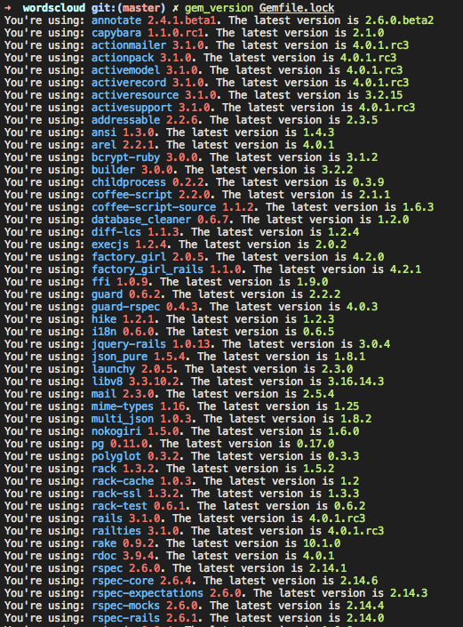

# gem\_version

Gem\_version is a simple script to show the latest versions of gems you're using in your project.

It depends on Gemfile.lock file.
It shows only gems that have newer versions.

## Screenshot

